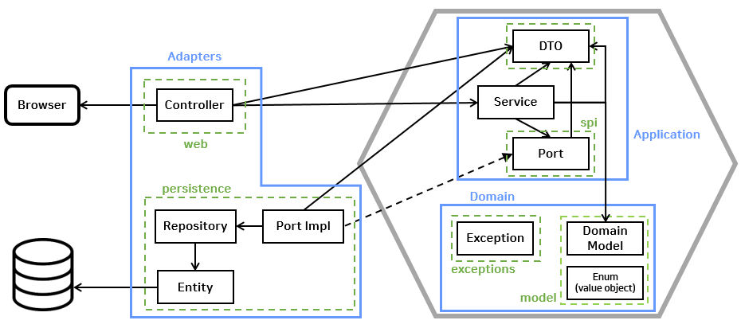

# CAUSW Backend 

<!--

## Overview

해당 애플리케이션은 [중앙대학교 소프트웨어학부 동문네트워크 커뮤니티](https://causw.net) 서비스의 Backend 서비스를 구동합니다.

서비스 이용 중 불편한 사항 혹은 문의사항이 있으신 경우 개발팀에 연락 부탁드리며, 서비스 개선을 위한 다양한 의견은 언제든 환영입니다.

프로젝트에 참여하시고 싶으시다면, [Contributing Guide](CONTRIBUTING.md)를 참조하시어 issue 혹은 pull request를 생성해주세요!

본 서비스에 많은 관심 부탁드립니다 :)

## Architecture

해당 애플리케이션는 <a href="https://en.wikipedia.org/wiki/Hexagonal_architecture_(software)">Hexagonal Architecture</a>를 따른다.

### Hexagonal Architecture

- 계층 구조(Layered Architecture) 의 대안으로써 사용자 인터페이스나 기반 요소(Infrastructure) 의 변경에 영향을 받지 않는 핵심 코드, 즉 비즈니스 로직을 만들고 이를 견고하게
  관리하기 위한 구조
- Ports and Adapters Architecture 라고 불리기도 함

    

> 육각형 구조의 핵심은 비즈니스 로직이 다른 기술 영역의 영향을 받게 하지 않는 것

- **Adapters**
    - 외부 영역과 내부 영역을 이어주는 어댑터
    - `web` : 웹 클라이언트에서의 요청을 처리
    - `entity` : 데이터베이스 접근하여 데이터 처리

- **Application**
    - 애플리케이션이 수행할 작업을 정의하고 표현력 있는 도메인 객체가 문제를 해결
    - 여기에는 도메인 로직이 없고, 오직 도메인의 여러 로직을 조합
    - `spi` : service provider interface (port interface) 를 관리, `port` 는 영속화 계층이 자신의 외부 영역과 상호 작용하는 방법을 정의

- **Domain**
    - 도메인에 관한 정보, 비즈니스 로직을 표현하는 일을 책임

-->

## Contact

**Email** : <a href="mailto:caucsedongne@gmail.com">caucsedongne@gmail.com</a>

## Docker Compose를 이용한 테스트 환경 구축 및 사용법

### 1. app-main 빌드

> 변경된 코드나 의존성이 있을 경우 이미지를 다시 빌드해야 합니다.

### 2. 컨테이너 및 볼륨 정리 (선택 사항)

> docker compose down -v

- **설명:**  
  모든 컨테이너와 네트워크, **그리고 연결된 볼륨까지 모두 삭제**할 때 사용합니다.
    - DB를 초기화하거나, 깨끗한 환경에서 테스트를 진행하고 싶을 때 유용합니다.
    - 일부 데이터(예: DB 볼륨)를 보존하려면 `-v` 옵션 없이 `docker compose down`만 실행하세요.

### 3. 컨테이너 실행

> docker compose up

- **설명:**  
  `docker-compose.yml`에 정의된 모든 서비스가 실행됩니다.
- 백그라운드(Detached) 모드로 실행하려면:

> docker compose up -d